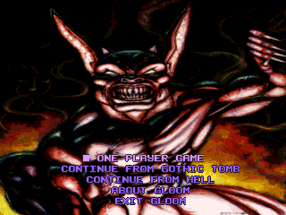
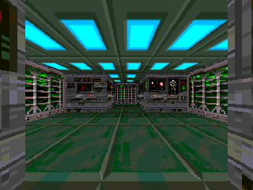
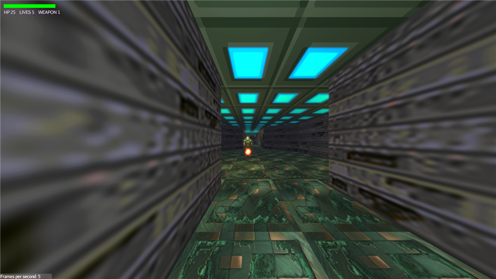
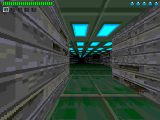
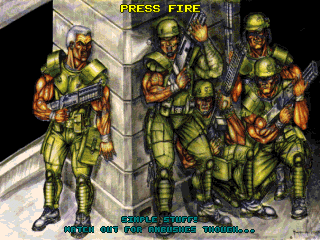

# Gloom — Java port

*Read this in [French](README_FR.md).*

A Java port of **Gloom** (Black Magic Software, Amiga 1995), the first Doom clone to ship on the
Amiga. The engine is rewritten **line by line from the original 68020 assembly**
([earok/GloomAmiga](https://github.com/earok/GloomAmiga)) — no emulator, no reinterpretation: the
Java code follows the asm instruction by instruction, and the `.s` sources stay the reference
whenever something is in doubt.

The original engine is a software rasteriser that "draws" its scene into a **copperlist**: one
colour-register poke per pixel, replayed to the screen by the Amiga copper. The port throws that
display path away — it renders into a plain RGB framebuffer — and keeps what matters: the memory,
the arithmetic, the data formats and the game rules, taken from the assembly rather than guessed
at again.



Ported by **Guillaume Monet**.

---

## Two renderers, one simulation

A launcher offers two views at startup. They share **exactly** the same game code: the same
emulated 68k RAM, the same object lists, the same AI, the same campaign script. Only the display
changes.

| | **GLOOM CLASSIC** | **GLOOM REBIRTH** |
|---|---|---|
| rendering | the original rasteriser, ported | a real 3D scene (jMonkeyEngine) |
| internal resolution | 320 × 240 | the screen's own |
| what you get | pixel fidelity | dynamic lighting, shadows, bloom, mouselook |

| CLASSIC (2D) | REBIRTH (3D) |
|---|---|
|  |  |

The HUD, the menus and the story screens are the game's own, decoded from its own data (IFF
images, 7-plane Amiga font):

| In-game HUD | Story screen |
|---|---|
|  |  |

Two variants of the rasteriser are ported: `gloom.s` (chunky, `focshft 6`, wide FOV) and `gloom2.s`
(planar/AGA, `focshft 7` + `castrots128`, the less distorted "Deluxe" projection). They share the
same rasteriser — only the focal length and the ray table differ.

---

## Porting decisions

### 68k RAM as a plain byte array

All of the game's memory is **one flat, big-endian 64 MB `byte[]`** (`gloom.Mem`). Registers
`d0-d7`/`a0-a6` become `int`s, and every access goes through typed helpers (`Mem.b/w/l`, `ub/uw`,
`wb/ww/wl`) that reproduce 68k byte order and arithmetic. `gloom.M68k` covers the rest (`swap`,
`muls/mulu`, `divs/divu`, sign extension, `.w` shifts).

This is what makes the line-by-line port possible: a struct from the asm stays at **the same
address and the same offset** it had originally, quirks included. And there are quirks — in Gloom,
`ob_nxvec` and `ob_lives` are the **same word** (`rs.w 0`), as are `ob_nzvec` and `ob_infra`. A
"clean" port would have split those fields and broken the game silently.

The safety net: `gradle checkLayout` checks every struct offset against the `.s` file. It has to
print `TOUT OK`.

### What is NOT ported: the hardware layer

The copper, the blitter, C2P, the Paula audio registers and the CIA interrupts have no useful
equivalent here. In their place sits a thin **host layer**: LWJGL 3 (GLFW/OpenGL/OpenAL) on PC,
the Android APIs on phones. The engine knows nothing about it.

The decoupling is real and measurable: out of the port's ~13,500 lines, only **four files** depend
on LWJGL (`host/Main`, `host/Display`, `host/Audio`, `rebirth/DesktopGlue`), and the Android APK
compiles the **same sources** as the desktop build, without a single duplicated line. Two
interfaces isolate the rest:

- `HostGlue` — the three things in the 3D view that aren't portable (cursor lock and framebuffer
  size via GLFW, PNG screenshot writing via AWT);
- `AudioBackend` — OpenAL on PC, `AudioTrack` on Android.

### Audio rebuilt the way Paula did it

Sound isn't handed off to some higher-level library. The samples are in Gloom's own format
(`[period][length in words][signed 8-bit PCM]`), and the **Paula period** gives the playback
frequency (`3546895 / period`). On Android the 4 DMA voices are replayed by hand, with a 16.16
fixed-point step and the same voice-allocation rules (a free one, else the least prioritary one,
else nothing) — then mixed with the music into a single stream.

The MED music (MMD0/MMD1) is a player written for this port: sequencer plus 4-voice mixer, the
original replayer being a non-portable 68k blob.

### One simulation behind both renderers

The 3D view isn't a second game. It **reads the world state out of the 68k RAM** every frame and
translates it into a jMonkeyEngine scene: walls extruded from the map's zones, the original sprites
as billboards (with the 8-direction frame selection), gore decals on the floor, blood drops as a
single mesh. The simulation runs on a fixed timestep (1/60 s), so gameplay keeps its speed whatever
the framerate is.

### Android: what measuring taught us

The port runs on a phone (measured on a Xiaomi: 60 fps in 2D, ~55 in 3D). Two non-obvious findings,
reached by instrumenting rather than guessing:

- **The 2D ran at half speed** because `lockCanvas()` hands back a *software* canvas: scaling the
  320 × 240 framebuffer up to fullscreen was happening on the CPU. `Surface.lockHardwareCanvas()`
  was all it took (35 → 60 fps).
- **In 3D, geometry costs nothing** — 204 triangles, 27 draw calls: this really is a 1995 game. All
  of the cost is *per pixel*: 2.6 Mpx against 0.077 on the Amiga, with 14-light lighting. The only
  effect that pushed past the frame budget was **full-resolution bloom**; computing it at quarter
  resolution makes it free without changing how it looks.

---

## What works

- **Levels chain together**: title screen, menu, story screens, the full campaign driven by the
  original script, checkpoints and resume ("CONTINUE FROM…").
- **Movement and collision** following the asm's rules (sliding along walls, crushing), all five
  weapons firing with their own damage, rates and sounds.
- **AI per type**: marine, baldy, terra, ghoul, phantom, demon, lizard, troll — each with its
  original logic (charge, fire, dodge). Bosses: the dragon (circling plus homing missiles) and the
  deathhead (soul suck, which drags the player towards it).
- **Full gore**: impact sparks, 24 blood drops *on every hit taken*, gibs with gravity, persistent
  floor decals, a splat on the view when a drop grazes the camera.
- Monsters **flinch** when hit: stunned and untouchable for a moment.
- **Powerups**: weapon, thermo, invisibility, "hyper" invincibility, bouncy bullets, with their
  timers, their messages and their expiry warnings.
- **Dynamic geometry**: doors, rotating polygons, texture animations, trigger zones (ambushes,
  teleports, exit).
- **Audio**: every effect, the monsters' ambient voices, and the MED music.
- **3D view**: dynamic lighting (torch, muzzle flash, bullets), optional HD textures, thermal vision
  through walls, a persistent options menu, remappable controls.
- **Android**: a single APK with both renderers, touch controls, assets fetched on first run.

## What's missing

- **2-player mode** (serial modem link) and the chat — out of scope, like the rest of `ap.s`.
- The **Defender mini-game** (`combatok`).
- The music volume fade between levels (`fadevol`).
- Hit sounds are faithful, but a few monsters' **ambient voices** still need checking in situ.
- `ob_infra`: a leftover from the original — the "infrared" bonus actually hands you the thermo
  goggles, and the variable is never read anywhere. Reproduced as is.

---

## Running the game

### From source

You need the asset repository **next to** this one (the assets aren't redistributable, see below):

```
Gloom/
├── GloomAmiga/     ← git clone https://github.com/earok/GloomAmiga
└── gloom-java/
    └── java/       ← this Gradle project
```

Then, from `java/`:

```bash
gradle run                        # full game (2D / 3D launcher)
gradle run2                       # the gloom2.s variant (focshft 7 + castrots128)
gradle rebirth                    # straight into the 3D view
gradle run -Dscale=4              # bigger window (320×240 internally)
gradle run -Dmap=map1_3 -Dtile=1  # a single level (testing / sightseeing)
```

Options: `-Dw= -Dh= -Dscale= -Dmap= -Dtile= -Dengine=gloom2 -Dmedspeed= -Dgloom.assets=`.

**Requirements**: JDK 21 (the Gradle toolchain is pinned to it, and `jpackage` comes from it),
Gradle 9.x. The LWJGL natives are set to Windows x64; for Linux/macOS, change `lwjglNatives` in
`build.gradle` and build **on the target platform**.

**Controls** — `W`/`S` or `↑`/`↓` forward/back, `A`/`D` strafe, `←`/`→` turn, left click / `Ctrl` /
`Space` to fire and confirm, `Esc` to quit. In 3D the mouse aims, and the keys are remappable in the
OPTIONS menu.

### Android

A single APK holds both renderers. **Left thumb**: forward, back, turn. **Right thumb**: strafe
(◀ ▶) and fire. **MENU button**, top right: steps back one level (game → menu → launcher → quit),
same as the back key.

Android 8.0 minimum. Assets are downloaded on first run (network needed that once only).

---

## How it's verified

There are no unit tests in the usual sense: the reference isn't a specification, it's an assembly
file. So each subsystem has its own **harness**, which replays a scenario and compares the behaviour
to what the asm describes. About thirty in total, all under `src/gloom/tools/`:

```bash
gradle checkLayout        # memory layout: every offset against the .s
gradle mathTest           # RNG, angles, calcangle
gradle mapTest            # map and texture loading
gradle goreTest           # blood, gibs, decals, flinch → gore.png
gradle monsterTest        # AI per monster type
gradle bossTest           # dragon and deathhead
gradle powerupTest        # powerups, messages, animated objects, soul suck
gradle medTest            # MED player → med1.wav
gradle levelRenderTest    # renders one frame of a real level → level.png
gradle rebirth -Dshot     # screenshot of the 3D view → rebirth.png
```

Each one prints `TOUT OK` or writes a demonstration PNG/WAV. `gradle tasks --group verification`
lists them all.

---

## Layout

| directory | contents |
|---|---|
| `src/gloom/` | the engine: `Mem`, `M68k`, `Render`, `Objects`, `Player`, `Map`, `Events`, `Sfx`, `MedPlayer`… |
| `src/gloom/host/` | the PC host layer (LWJGL): window, audio, game loop, HUD, menus, sequencer |
| `src/gloom/rebirth/` | the jMonkeyEngine 3D view |
| `src/gloom/data/` | the asm's `.data` sections: precomputed tables, `objinfo` |
| `src/gloom/tools/` | the verification harnesses |
| `android/` | the Android module (compiles `../src` as is) |
| `scripts/` | side tooling (AI upscaling of the textures for HD mode) |
| `dist/` | the asset-fetching scripts shipped with the package |

---

## Distribution

```bash
gradle jpackage           # self-contained native app → build/jpackage/Gloom/Gloom.exe (bundled JRE)
gradle jpackageInstaller  # native installer: .msi (needs WiX), .dmg, .deb
cd android && gradle assembleRelease    # Android APK
```

The package holds the executable, the JRE, the jars and **`fetch-assets.bat`/`.sh`** — but **not the
assets** (see below). The user runs the script once, then the game.

Ready-made binaries are on the
[releases page](https://github.com/guillaumemonet/gloom-java/releases).

---

## Licence and credits

*Gloom* is © **Black Magic Software**. The **original `.s`/`.bb2` sources are public domain** (see
the `GloomAmiga` repository) and are this port's reference.

The **assets** — graphics, sounds, maps — **are not**, and are **never redistributed** here: neither
the repository, nor the PC package, nor the APK contains them. They are fetched from
[earok/GloomAmiga](https://github.com/earok/GloomAmiga), a preservation repository, on first run.

Original engine: **Black Magic Software** (1995).
Java port: **Guillaume Monet**.

The port was carried out with AI assistance (Claude, Anthropic): writing the translation code, the
verification harnesses and the instrumentation. The architectural decisions, the validation against
the original assembly and the result remain the author's own.
